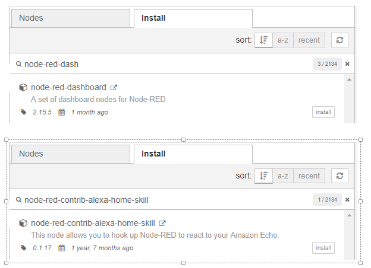
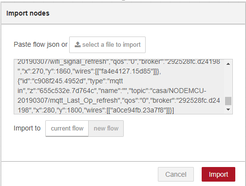
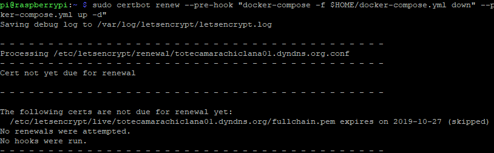

# Despliegue desde cero.

A partir de ahora viene el despliegue completo desde cero.
	
	
# SERVICIO MOSQUITTO

Vamos a crearlo como servicio en compose. Procedemos a crear el contexto de Dockerfile para mosquitto.
```
sudo mkdir $HOME/mosquitto
```

En el directorio ***mosquitto***, crear un archivo llamado ***docker-entrypoint.sh*** y editarlo. Este script será ejecutado cuando se cree la imagen del contenedor.
```
cd $HOME/mosquitto
```
```
sudo nano docker-entrypoint.sh
```

Pegar el siguiente contenido en el archivo.
```
#!/bin/ash
	
	set -e
	
	if ( [ -z "${MOSQUITTO_USERNAME}" ] || [ -z "${MOSQUITTO_PASSWORD}" ] ); then
	  echo "MOSQUITTO_USERNAME or MOSQUITTO_PASSWORD not defined"
	  exit 1
	fi
	
	# create mosquitto passwordfile
	touch passwordfile
	mosquitto_passwd -b passwordfile $MOSQUITTO_USERNAME $MOSQUITTO_PASSWORD
	
	exec "$@"
```

Guardarlos (Ctrl+X, Y, Enter)

Ahora lo hacemos ejecutable
```
sudo chmod 755 docker-entrypoint.sh
```
	
Creamos un archivo para almacenar variables de entorno. Este archivo se llamará ***environment.env*** (se puede cambiar el nombre) Posteriormente recuperaremos los valores con ***${clave}*** en el archivo ***compose***.
```
sudo nano environment.env
```

Y pegamos el siguiente texto
```
MOSQUITTO_USERNAME=antonio
MOSQUITTO_PASSWORD=el_password
```

Guardamos y salimos.


Creamos el Dockerfile para crear la imagen de mosquitto
```
sudo nano Dockerfile
```

Y pegamos el siguiente texto.
```
FROM eclipse-mosquitto:1.6.3
COPY docker-entrypoint.sh /
ENTRYPOINT ["sh", "./docker-entrypoint.sh"]
CMD ["/usr/sbin/mosquitto", "-c", "/mosquitto/config/mosquitto.conf"]
```

Cuando Compose llame a build para el servicio ***mosquitto***, se creará una imagen basada en la versión de ***eclipse-mosquito:1.6.3***. Se copiará el archivo ***docker-entrypoint.sh*** en la raíz del contenedor (este archivo crea el archivo de password de mosquitto). Se ejecuta ***docker-entrypoint.sh*** dentro del contenedor. Por último se ejecuta el software mosquito indicándole donde está el archivo de configuración. 

La imagen final generada por el Dockerfile se llama "eclipse-mosquitto"
	

Creamos el directorio que almacenará  el archivo de configuración de mosquitto
```
sudo mkdir $HOME/mosquitto/config
```

Creamos un archivo vacío que más adelante almacenará la configuración de mosquitto.
```
sudo touch $HOME/mosquitto/config/mosquitto.conf
```

Creamos dos directorios que serán usados para volúmenes bind.
```
sudo mkdir $HOME/mosquitto/data
```
```
sudo mkdir $HOME/mosquitto/log
```

Todas las configuraciones previas se guardan en el siguiente archivo ***docker-compose.yml***
```
sudo nano $HOME/docker-compose.yml
```

Pegar el siguiente texto (Ojo con el pegado, si se pegan tabuladores \t, da error).
```
version: '3.5'
services:
    # broker MQTT eclipse-mosquitto.
    mosquitto:
    build:
        context: ./mosquitto  # indicamos donde está el contexto del Dockerfile para generar la imagen.

    env_file:
        - ./mosquitto/environment.env # archivo con las variables de entorno usuario/password. Editarlo para configurar.

    image: eclipse-mosquitto  # Este es el nombre de la imagen que genera el build.

    container_name: eclipse-mosquitto # Nombre del contenedor que creará el servicio.

    restart: always   # Que siempre se reinicie.

    volumes:
        - ./mosquitto/config/mosquitto.conf:/mosquitto/config/mosquito.conf:ro   # Volumen bind para el archivo de configuración.
        - ./mosquitto/data:/mosquitto/data
        - ./mosquitto/log:/mosquitto/log

    ports:
        - 1883:1883
```

Para probarlo
```
cd $HOME
```

Se ejecuta la sección "build" de "docker-compose.yml", que generará las imágenes.
```
docker-compose build
```

Crea el stack o pila se servicios (Por ahora solo "mosquitto")
```
docker-compose up -d
```

Muestra los contenedores levantados.
```
docker container ls  -a
```

Creo un contexto para crear otro contenedor que tenga instaladas las herramientas clientes de mosquitto.
```
sudo mkdir $HOME/mosquitto-clients
```
```
sudo nano $HOME/mosquitto-clients/Dockerfile
```

Pegamos el siguiente texto:
```
FROM ubuntu:19.10
RUN apt-get update && apt-get install -y mosquitto-clients
```	
	
Creamos una imagen con las herramientas para probar MQTT y lo subimos al repositorio.
```
cd $HOME/mosquitto-clients
```
```
docker build -t antsala/mosquitto-clients:latest .
```
```
docker login (Poner credenciales)
```
```
docker image push antsala/mosquitto-clients:latest
``` 

Con ello ya la tenemos para instanciar contenedores para probar MQTT. Creo un contenedor con las herramientas cliente de mosquitto.
```
docker container run -itd --name mqtt_clients antsala/mosquitto-clients:latest
```

Entro en el contenedor
```
docker container exec -it mqtt_clients sh
```

Nos subscribimos a los topics enviados a ***casa/#***.
(Nota:  ***-d = debug***, para ver lo que hace))
```
mosquitto_sub  -h 192.168.1.200 -t casa/# -d -u antonio -P mi_password  
```
		
Abrimos otra conexión de ***PuTTY***, conectamos con el contenedor y enviamos un topic (debe poder leerse desde la otra terminal)
```
docker container exec -it mqtt_clients sh
```

Dentro del contenedor, ejecutamos el siguiente comando.
```
mosquitto_pub -h 192.168.1.200 -m "Topic de prueba desde cocina" -t  "casa/cocina" -d -u antonio -P mi_password
```

Una vez comprobado salimos de los contenedores con ***exit*** o ***Ctrl+C, exit***.

Detenemos el contenedor con las herramientas de mqtt para ahorrar recursos.
```
docker container stop mqtt_clients
```
	
Para eliminar el stack (apagando los contenedores de los servicios):
```
docker-compose down
```

# SERVICIO NODERED
	

Creamos una carpeta para el contexto de Dockerfile
```
sudo mkdir $HOME/node-red
```

Creamos un Dockerfile en esa carpeta
```
sudo nano $HOME/node-red/Dockerfile
```
	
Copiamos el siguiente texto y luego guardamos.
```
FROM nodered/node-red-docker:rpi
```
	
Editamos ***docker-compose.yml*** para añadir el nuevo servicio
```
sudo nano $HOME/docker-compose.yml
```

Pegamos el siguiente texto.
(Nota. Se debe eliminar el texto previo, porque este pegado también incluye todo los previo.)
```
version: '3.5'

services:
    # broker MQTT eclipse-mosquitto.
    mosquitto:
    build:
        context: ./mosquitto  # indicamos donde está el contexto del Dockerfile para generar la imagen.

    env_file:
        - ./mosquitto/environment.env # archivo con las variables de entorno usuario/password. Editarlo para configurar.

    image: eclipse-mosquitto  # Este es el nombre de la imagen que genera el build.

    container_name: eclipse-mosquitto # Nombre del contenedor que creará el servicio.

    restart: always   # Que siempre se reinicie.

    volumes:
        - ./mosquitto/config/mosquitto.conf:/mosquitto/config/mosquito.conf:ro   # Volumen bind para el archivo de configuración.
        - ./mosquitto/data:/mosquitto/data
        - ./mosquitto/log:/mosquitto/log

    ports:
        - 1883:1883

# node-red
    node-red:
    build:
        context: ./node-red  # Indicamos donde está el contexto del Dockerfile para generar la imagen.

    image: node-red  # Este es el nombre de la imagen que genera el build.

    container_name: node-red  # Nombre del contenedor que creará el servicio.

    restart: always    # Que siempre se reinicie.

    ports:
        - 1880:1880

    volumes:
        - node-red-data:/data

volumes:
    node-red-data:
    name: the-node-red-data
```

El volumen con nombre ***the-node-red-data*** se utiliza para la persistencia de node-red (nodos que instalamos, flujos, etc) sin esto se perdería toda la configuración cuando se elimine a capa reescribible al reiniciar el contenedor o los servicios.

Probamos
```
cd $HOME
```
```
docker-compose up -d  
```
```
docker container ls -a
```

En un navegador conectar a http://192.168.1.200:1880. Debe verse la interfaz de nodered.

Comprobamos el uso de recursos
```
sudo docker stats
```

Podemos ver la salida del log:
```
docker-compose logs
```
	
# SERVICIO NGINX

Creamos un directorio de contexto para ***NGINX***.
```
sudo mkdir $HOME/nginx-reverse-proxy
```

Y creamos y editamos el archivo de configuración de nginx
```
sudo nano $HOME/nginx-reverse-proxy/nginx.conf
```

Pegamos el siguiente texto
```
worker_processes 1;

events { worker_connections 1024; }

http {

    sendfile on;

    server {
        listen 80;

        location / {
            proxy_ssl_session_reuse  on;
            proxy_pass               http://node-red:1880;  #  Aprovechamos la resolución de nombres de contenedores que proporciona la red de tipo bridge.
            proxy_http_version       1.1;
            proxy_set_header         Upgrade        $http_upgrade;
            proxy_set_header         Connection     "upgrade";
            proxy_redirect           default;
            proxy_read_timeout       90;
        }
    }
}
```

Editamos el Dockerfile de nginx.
```
sudo nano $HOME/nginx-reverse-proxy/Dockerfile
```

Pegamos el siguiente texto.
```
FROM nginx:alpine
```

Guardamos (Ctrl+X, Y, Enter)

Editamos ***docker-compose.yml*** para añadir el servicio de nginx.

```
sudo nano docker-compose.yml
```
	
Pegar el siguiente texto. Sustutir todo el archivo por este.
(Nota: Se han añadido cláusulas ***depends_on*** a lo servicios anteriores)
```
version: '3.5'

services:

    # broker MQTT eclipse-mosquitto.
    mosquitto:
    build:
        context: ./mosquitto  # Indicamos donde está el contexto del Dockerfile para generar la imagen.

    env_file:
        - ./mosquitto/environment.env # Archivo con las variables de entorno usuario/password. Editarlo para configurar.

    image: eclipse-mosquitto  # Este es el nombre de la imagen que genera el build.

    container_name: eclipse-mosquitto # Nombre del contenedor que creará el servicio.

    restart: always   # Que siempre se reinicie.

    volumes:
        - ./mosquitto/config/mosquitto.conf:/mosquitto/config/mosquito.conf:ro   # Volumen bind para el archivo de configuración.
        - ./mosquitto/data:/mosquitto/data
        - ./mosquitto/log:/mosquitto/log

    ports:
        - 1883:1883

    # node-red
    node-red:
    build:
        context: ./node-red  # Indicamos donde está el contexto del Dockerfile para generar la imagen.

    image: node-red  # Este es el nombre de la imagen que genera el build.

    container_name: node-red  # Nombre del contenedor que creará el servicio.

    restart: always    # Que siempre se reinicie.

    ports:
        - 1880:1880

    volumes:
        - node-red-data:/data  # Ofrecemos persistencia de la configuración de node-red.

    depends_on:
        - mosquitto


    # nginx-reverse-proxy
    nginx-reverse-proxy:
    build:
        context: ./nginx-reverse-proxy  # Indicamos donde está el contexto del Dockerfile para generar la imagen.

    image: nginx-reverse-proxy  # Este es el nombre de la imagen que genera el build.

    container_name: nginx-reverse-proxy  # Nombre del contenedor que creará el servicio.

    restart: always  # Que siempre se reinicie.

    ports:
        - 80:80
        - 443:443

    volumes:
        - ./nginx-reverse-proxy/nginx.conf:/etc/nginx/nginx.conf:ro

    depends_on:
        - node-red

volumes:
    node-red-data:
    name: the-node-red-data
```
	
Compilamos.
```
docker-compose build
```
	
Levantamos los servicios
```
docker-compose up -d
```
	
Comprobamos que vaya todo bien
```
docker container ls
```	
	
Creamos una red personalizada en Compose para que haya resolución DNS. 

Editar el ***docker-compose.yml***.
```
sudo nano $HOME/docker-compose.yml
```

Pegar el siguiente texto (se ha añadido un objeto network al final y los contenedores hacen referencia a esta red). 
(Nota: Sustituir todo el contenido por este)
```
version: '3.5'

services:

    # broker MQTT eclipse-mosquitto.
    mosquitto:
    build:
        context: ./mosquitto  # Indicamos donde está el contexto del Dockerfile para generar la imagen.

    env_file:
        - ./mosquitto/environment.env # Archivo con las variables de entorno usuario/password. Editarlo para configurar.

    image: eclipse-mosquitto  # Este es el nombre de la imagen que genera el build.

    container_name: eclipse-mosquitto # Nombre del contenedor que creará el servicio.

    restart: always   # Que siempre se reinicie.

    volumes:
        - ./mosquitto/config/mosquitto.conf:/mosquitto/config/mosquito.conf:ro   # Volumen bind para el archivo de configuración.
        - ./mosquitto/data:/mosquitto/data
        - ./mosquitto/log:/mosquitto/log

    ports:
        - 1883:1883

    networks:
        - container-network


    
    # node-red
    node-red:
    build:
        context: ./node-red  # Indicamos donde está el contexto del Dockerfile para generar la imagen.

    image: node-red  # Este es el nombre de la imagen que genera el build.

    container_name: node-red  # Nombre del contenedor que creará el servicio.

    restart: always    # Que siempre se reinicie.

    ports:
        - 1880:1880

    volumes:
        - node-red-data:/data

    networks:
        - container-network

    depends_on:
        - mosquitto

    # nginx-reverse-proxy
    nginx-reverse-proxy:
    build:
        context: ./nginx-reverse-proxy  # Indicamos donde está el contexto del Dockerfile para generar la imagen.

    image: nginx-reverse-proxy  # Este es el nombre de la imagen que genera el build.

    container_name: nginx-reverse-proxy  # Nombre del contenedor que creará el servicio.

    restart: always  # Que siempre se reinicie.

    ports:
        - 80:80
        - 443:443

    networks:
        - container-network

    volumes:
        - ./nginx-reverse-proxy/nginx.conf:/etc/nginx/nginx.conf:ro

    depends_on:
        - node-red

networks:
    container-network:
    name: the-container-network
    driver: bridge

volumes:
    node-red-data:
    name: the-node-red-data
```
	
Actualizamos el servicio:
```
docker-compose up -d
```
	
Para comprobar si nginx está corriendo, nos conectamos con un navegador a http://192.168.1.200:80, debe aparecer la página de nodered.
	
	
Ahora hay que cargar los flujos en node-red. Pero antes hay que administrar la paleta (manage-pallete) de nodos y añadir los siguientes
```
node-red-dashboard, node-red-contrib-alexa-home-skill
```




Importar los flujos en node-red.
(Nota: Los backups de los flujos están el la carpeta ***Backup Flujos Node-Red*** del repositorio)
(Nota: La importación de los flujos se hace desde la página de edición de nodered: http://192.168.1.200:1880/)



Los flujos se han importado. Hacer un ***Deploy***. Es posible que la conexión con el servidor mqtt haya que actualizarla. Si la editamos pone ***localhost*** como servidor mqtt. Hay que cambiarla a ***mosquitto*** que es el nombre del contenedor del servidor mqtt y, gracias a la resolución de nombres que ofrece la red de tipo bridge, podemos resolverlo.

Comprobar en la pestaña ***Alexa*** que los nodos conectan. Si no fuera así, para solucionarlo editar uno de ellos, para poder poner las credenciales (Están en la copia de seguridad de credenciales). Los nodos, después de un momento, deben conectar a la función de AWS.

# Let's Encrypt

Vamos a crear un volumen bind para Let's encrypt. A través de este volumen, podemos generar hacer llegar los certificados digitales al contenedor ***nginx-reverse-proxy***.
```
sudo nano $HOME/docker-compose.yml
```

En el contenedor de nginx, añadir el siguiente volumen bind ***/etc/letsencrypt/:/etc/letsencrypt/***.

El compose debe quedar así:
```
version: '3.5'

services:

    # broker MQTT eclipse-mosquitto.
    mosquitto:
    build:
        context: ./mosquitto  # Indicamos donde está el contexto del Dockerfile para generar la imagen.

    env_file:
        - ./mosquitto/environment.env # Archivo con las variables de entorno usuario/password. Editarlo para configurar.

    image: eclipse-mosquitto  # Este es el nombre de la imagen que genera el build.

    container_name: eclipse-mosquitto # Nombre del contenedor que creará el servicio.

    restart: always   # Que siempre se reinicie.

    volumes:
        - ./mosquitto/config/mosquitto.conf:/mosquitto/config/mosquito.conf:ro   # Volumen bind para el archivo de configuración.
        - ./mosquitto/data:/mosquitto/data
        - ./mosquitto/log:/mosquitto/log

    ports:
        - 1883:1883

    networks:
        - container-network

    # node-red
    node-red:
    build:
        context: ./node-red  # Indicamos donde está el contexto del Dockerfile para generar la imagen.

    image: node-red  # Este es el nombre de la imagen que genera el build.

    container_name: node-red  # Nombre del contenedor que creará el servicio.

    restart: always    # Que siempre se reinicie.

    ports:
        - 1880:1880

    volumes:
        - node-red-data:/data


    networks:
        - container-network

    depends_on:
        - mosquitto


    # nginx-reverse-proxy
    nginx-reverse-proxy:
    build:
        context: ./nginx-reverse-proxy  # Indicamos donde está el contexto del Dockerfile para generar la imagen.

    image: nginx-reverse-proxy  # Este es el nombre de la imagen que genera el build.

    container_name: nginx-reverse-proxy  # Nombre del contenedor que creará el servicio.

    restart: always  # Que siempre se reinicie.

    ports:
        - 80:80
        - 443:443

    networks:
        - container-network

    volumes:
        - ./nginx-reverse-proxy/nginx.conf:/etc/nginx/nginx.conf:ro
        - /etc/letsencrypt/:/etc/letsencrypt/

    depends_on:
        - node-red

networks:
    container-network:
    name: the-container-network
    driver: bridge

volumes:
    node-red-data:
    name: the-node-red-data
```	
	
Preparamos la raspberry para que pueda pedir (y renovar) certificados a Let's Encrypt. Estos certificados se utilizarán para https en nginx. Instalamos "certbot", el cliente de Let's encrypt.
```
sudo apt-get install certbot
```
	
Vamos a usar el plugin en modo ***standalone***". Al ejecutarlo (certbot) arranca un servidor web para la solicitud del certificado. Esto significa que los puertos 80 y 443 deben estar disponibles, así que debemos apagar el servidor nginx, ya que tiene los dos puertos enlazados.
	
Además, para la verificación, let's encrypt se conectará al cliente (certbot) que está haciendo de nuestro servidor web (nginx). En la fase de descarga inicial del certificado aún no se puede mover el tráfico por ssl, ya que no hay certificado alguno. Por esta razón, certbot se expone en el puerto 80, así que hay que mapear el tráfico Http (80) en el router hacia 192.168.1.200. Cuando tengamos el certificado, se lo instalaremos a nginx, para proteger las conexiones hacia node-red desde Internet, así que también tenemos que crear una regla de redirección de puerto hacia el 443 de la ip 192.168.1.200. En definitiva, dos mapeos para los puertos 80 y 443 hacia la ip interna 192.168.1.200. 
(NOTA IMPORTANTE. No puede haber ningún contenedor que tenga mapeado el puerto 80, así que lo mejor es parar todo el servicio?
```
sudo docker-compose down
```	

Vamos a crear el certificado. Se pueden crear certificados para diferentes URL, para ello repetir el parámetro ***-d*** por cada una de ellas.   
(Nota: Seguir las instrucciones)
```
sudo certbot certonly --standalone -d <sevilla.antsala.xyz>
```
	
La autoridad certificadora de Let's Encrypt entrega certificados de corta vida, solo son válidos por 90 días. Esto hace que sea importante el proceso de renovación automático. Certbot lo hace fácil por medio del comando ***certbot renew***, que comprueba los certificados instalados y renueva aquellos que expirarán en menos de 30 días.

Vamos a usar el mismo plugin para la renovación que usamos para pedir el certificado, el plugin standalone. Para el proceso de renovación, los puerto 80 o 443 deben estar libres.

Certbot proporciona ***hooks*** antes y después del procedimiento de renovación, que usaremos para detener y arrancar el servidor web (nginx) durante la renovación, con la idea de liberar los puertos.

Los ***hooks*** se ejecutan solo cuando el certificado necesita ser renovado, de esta forma no hay downtime innecesario.

El comando docker-compose es el siguiente:
```
	sudo certbot renew --pre-hook "docker-compose -f $HOME/docker-compose.yml down" --post-hook "docker-compose -f $HOME/docker-compose.yml up -d"
```
	
Como se puede ver en la siguiente imagen, si se fuerza la renovación del certificado, pero no estamos en el periodo de validación, entonces no se hace nada (skipped)


	
Necesitamos que este procedimiento se realice son frecuencia, así que usamos crontab
```
sudo crontab -e
```

Elegir ***nano***, Escribir estas dos líneas al final y guardar.
```
@weekly sudo certbot renew --pre-hook "docker-compose -f $HOME/docker-compose.yml down" --post-hook "docker-compose -f $HOME/docker-compose.yml up -d"
@daily service nginx reload
```

Hasta el momento los certificados son solicitados y almacenados en raspbian. Ahora necesitamos proporcionárselos a nginx. La primera parte ya está configurada y consistía en crear un volumen bind para let's encrypt en el contenedor nginx. Esta configuración  ya se encuentra en el compose.
```
   volumes:
     - ./nginx-reverse-proxy/nginx.conf:/etc/nginx/nginx.conf:ro
     - /etc/letsencrypt/:/etc/letsencrypt/
```

Por defecto, un servidor virtual escucha en el puerto 80 y ahora tenemos que hacer que escuche en el 443, esto se hace por directivas ***listen***. Además el certificado debe estar definido y lo configuraremos con las directivas ***ssl_certificate*** y ***ssl_certificate_key***. Editamos el archivo de configuración de nginx.
```
sudo nano nginx-reverse-proxy/nginx.conf
```

Debe quedar de la siguiente forma.
(Nota: Sustituir el anterior y actualizar ***<poner_la_dns_correcta>***
```
worker_processes 1;

events { worker_connections 1024; }

http {

    sendfile on;

    server {
        listen 80;

        listen 443 ssl;
        ssl_certificate /etc/letsencrypt/live/<poner_la_dns_correcta>/fullchain.pem;
        ssl_certificate_key /etc/letsencrypt/live/<poner_la_dns_correcta>/privkey.pem;

        location / {
            proxy_ssl_session_reuse         on;
            proxy_pass                      http://node-red:1880;  #  Aprovechamos la resolución de nombres 
            proxy_http_version              1.1;
            proxy_set_header                Upgrade        $http_upgrade;
            proxy_set_header                Connection     "upgrade";
            proxy_redirect                  default;
            proxy_read_timeout              90;
        }
    }
}
```
	
Arrancamos nuestro stack
```
sudo docker-compose up -d
```

Conectamos con un navegador a https://<poner_la_dns_correcta>/ui y vemos si funciona.


	
