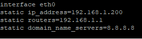
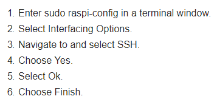
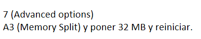

# Raspberry IoT con Docker.

Despliegue de IoT.


## Preparar la Raspberry.

Pasos a realizar.
* Descargar https://downloads.raspberrypi.org/raspbian_lite/images/raspbian_lite-2019-04-09/ (stretch última versión) 
* Formateamos la SD. Ver: Formatear con FAT32 y Windows una tarjeta > 32GB: https
* Quemamos la imagen descargada con "balenaEtcher-portable": https://www.balena.io/etcher/

Configuración Headless. Creamos un archivo llamado "ssh" en la SD. Esto se hace así porque por razones de reguridad ***ssh*** ya no está habilitado por defecto. Para habilitarlo creamos un archivo vacío llamado ***ssh*** (sin extensión) en la raíz del disco de arranque de la SD.

Ponemos la SD en la Raspberry y la iniciamos. Con el programa ***Advanced-IP-Scan*** localizaremos la IP de la Raspberry en la red y nos conectamos por ssh a dicha IP. El usuario es ***pi*** y el password ***raspberry***

Escribimos el siguiente comando para poder cambiar el password y configurar la WiFi.
```
sudo raspi-config
```

La IP la configuramos editando el siguiente archivo.
```
sudo nano /etc/dhcpcd.conf
```

Debe quedar así:



Ahora habilitamos SSH por medio de ***raspi-config***
```
sudo raspi-config
```

Y realizamos lo siguiente.



De nuevo, si no estamos en la aplicación, ejecutamos ***raspi-config***.
```
sudo raspi-config
```

Y como no tenemos interfaz gráfica reducimos la RAM asignada a ella. Hacemos.



Actualizamos la pi
```
sudo apt-get update
```
```
sudo apt-get upgrade
```

## Instalar Docker.

Instalamos los prerrequisitos.
```
sudo apt install -y  apt-transport-https ca-certificates curl gnupg2 software-properties-common
```

Instalar la clave GPG de Docker.
```
curl -fsSL https://download.docker.com/linux/$(. /etc/os-release; echo "$ID")/gpg | sudo apt-key add -
```

Añadir los repositorios oficiales de Docker
```
echo "deb [arch=armhf] https://download.docker.com/linux/$(. /etc/os-release; echo "$ID")  $(lsb_release -cs) stable" | sudo tee /etc/apt/sources.list.d/docker.list
```

Instalamos Docker
```
sudo apt update
```
```
sudo apt install -y docker-ce 
```

Hacer que Docker arranque al inicio
```
sudo systemctl enable docker
```
```
sudo systemctl start docker
```

Añadir al usuario "pi" al grupo "docker"
```
sudo usermod -aG docker pi  
```

Hacemos logout y login para actualizar.
	
Instalar Docker compose usando pip

```
sudo apt update
```
```
sudo apt-get install build-essential libssl-dev libffi-dev python3-dev
```
```
sudo apt install -y python python-pip
```
```
sudo pip install docker-compose
```
	
Probar docker
```	
docker run --rm hello-world
```

## Clonado del repo en la pi y creación del stack.

Este repositorio contiene todos los archivos para desplegar la infraestructura, así que en la pi, el la carpeta ***/home/pi*** (debemos estar en ella) escribimos.
```
git clone https://github.com/antsala/raspIoT.git
```

Lanzamos la aplicación.
```
cd $HOME
```

Se ejecuta la sección "build" de "docker-compose.yml", que generará las imágenes.
```
docker-compose build  
```

Crea el stack o pila se servicios.
```
docker-compose up -d  
```

Muestra los contenedores levantados. La infraestructura debe esta levantada.
```
docker container ls   
```

Si quieres ver como se generan desde cero todo, o entender al detalle cómo funciona, mira este archivo:
[Despliegue desde cero](Despliegue_desde_cero.md)
